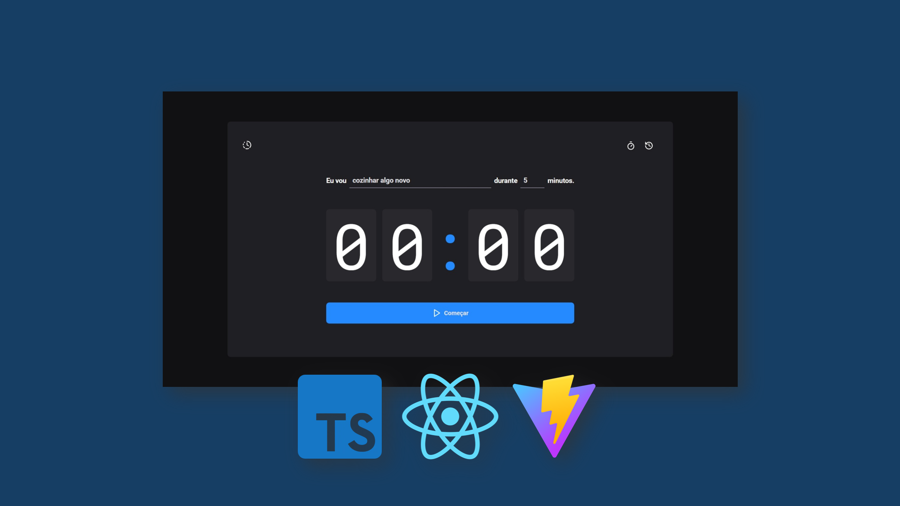
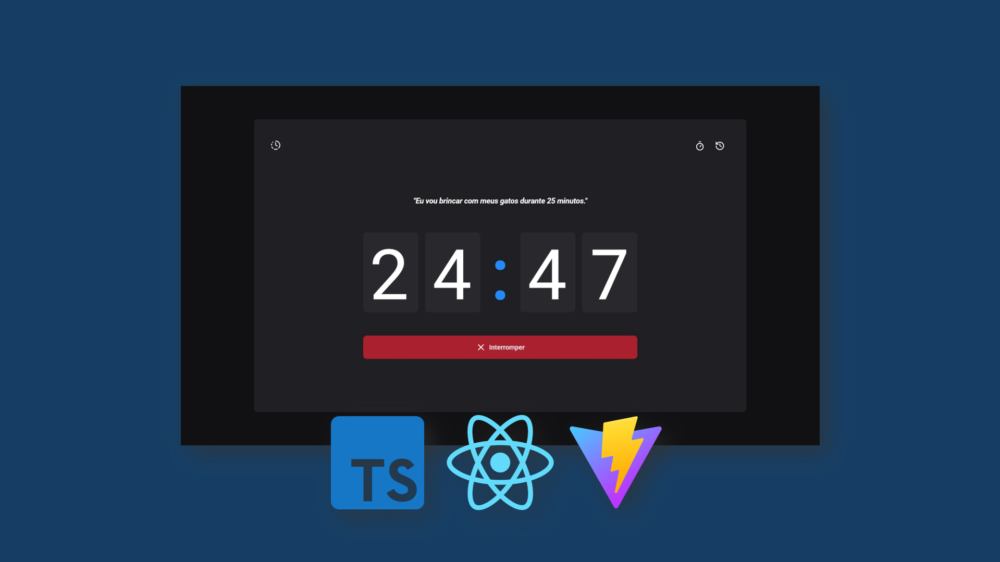
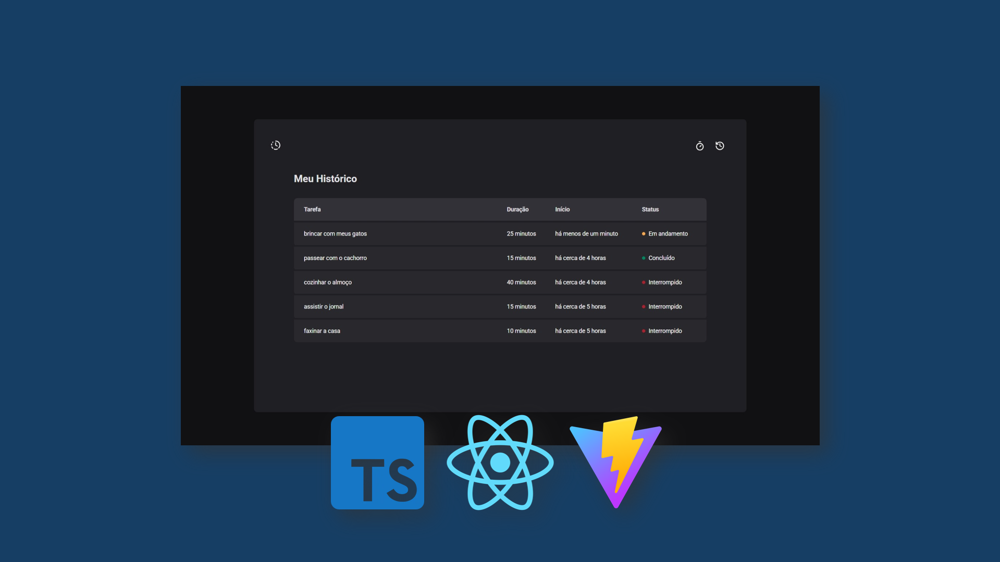

# Timer (Single-Page Application)

Timer is a simple single-page application (SPA) built as part of my studies at Rocketseat. It allows users to create and track timer cycles with customizable durations and task names.

## Features
- Create timer cycles ranging from 5 to 60 minutes, with increments of 5 minutes.
- Assign custom names to tasks.
- Live updates: The timer updates the window title in real-time.
- History page: Displays all past cycles, including task name, duration, creation date, and status (in progress, interrupted, or finished).
- Persistent data: Timer cycles are saved in LocalStorage, allowing users to retain their history even after closing the app.

## Technologies Used
- React for building the front-end.
- TypeScript for strong typing and improved development experience.
- Vite for fast development and optimized build processes.
- Context API with reducers and Immer for efficient state management.
- LocalStorage for data persistence.

## Project Gallery

  
  
  

## My Journey
This project was one of my exercises at Rocketseat and a valuable learning experience. My biggest challenge was working with useContext, but I overcame it and improved my understanding of state management, local storage, and UI responsiveness. Handling real-time updates and structured data efficiently made the timer app more reliable and intuitive for users.
